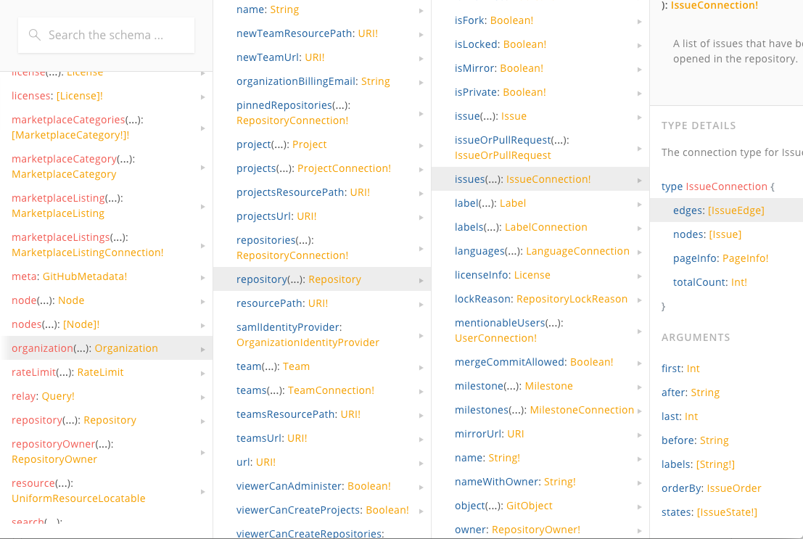
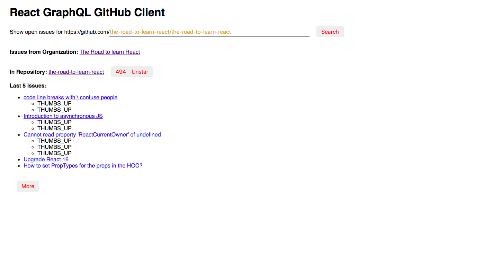

# React GraphQL

> A custom GraphQL client for Github simply implemented with vanilla React and Fetch API

## Screenshots





## Table of Contents

- [GraphQL Query](#graphql-query)
- [Features](#features)
- [Description](#description)

----
</br>

### GraphQL Query

#### The GraphQL API has the following features

- objects and fields
- nested objects
- fragments
- arguments and variables
- operation names
- directives

##### $ Introduction

Objects hold data about an entity. You can access the data by using a so called field in GraphQL. Fields are used to ask for specific properties that are available in objects.

A query in its most basic form consists of objects and fields in GraphQL terms. Objects can also be called fields.

Input:

```bash
{
  viewer {
    name
    url
  }
}
```

Output:

```bash
{
  "data": {
    "viewer": {
      "name": "Robin Wieruch",
      "url": "https://github.com/rwieruch"
    }
  }
}
```

</br>

When it comes to `aliases` and `arguments` and also `operation names`, you can compare it to `function names` and `function arguments` in `functions`.

Input

```bash
{
  book: organization(login: "the-road-to-learn-react") {
    ...sharedOrganizationFields
  }
  company: organization(login: "facebook") {
    ...sharedOrganizationFields
  }
}
fragment sharedOrganizationFields on Organization {
  name
  url
}
```

Output

```bash
{
  "data": {
    "book": {
      "name": "The Road to learn React",
      "url": "https://github.com/the-road-to-learn-react"
    },
    "company": {
      "name": "Facebook",
      "url": "https://github.com/facebook"
    }
  }
}
```

</br>

##### $ Advantages

GraphQL makes specifications to requests not on a *request level* but on a *field level*. Comparing to REST API, it saves bandwidth.

----
</br>

### Features

- Bootstrapped with [create-react-app](https://github.com/facebook/create-react-app)
- Github GraphQL API
- Consuming GraphQL with vanilla JavaScript
- No Apollo/Relay
- Powered by Fetch API (no [Axios](https://github.com/axios/axios))
- Using [GraphQL Playground](https://github.com/graphcool/graphql-playground) as developing tool.

----
</br>

### Description

This project is constructed with the instructions of this article: [A complete React with GraphQL Tutorial](https://www.robinwieruch.de/react-with-graphql-tutorial/#graphql-query-github-api). The front end app is implemented with vanilla react(as I call it), and makes asynchronous requests to Github GraphQL API only by Fetch API since it's powerful enough.

----
</br>

### Contributions

- `Branch` and/or `clone` the repo locally.
- `cd` into it
- install all the require packages: `npm i`
- build the project: `npm run build`
- start the project: `npm start`